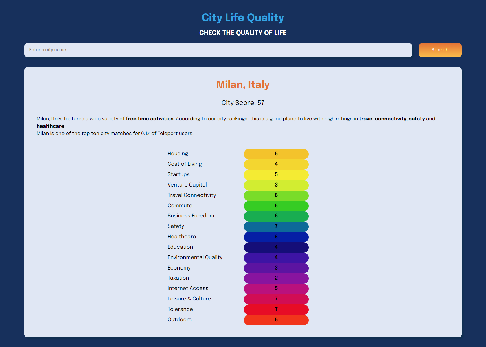

# City Life Quality 

## Table of Contents
1. [General Info](#general-info)
2. [Built With](#built-with)
3. [License](#license)
4. [Contact](#contact)

### General Info
This is a web app developed in Javascript. It allows you to get information on the quality of life in cities around the world.  
Project Link: https://github.com/GiorgiaAmato/city-quality-life  
App Link: https://life-quality.netlify.app/  

### Screenshot

## Built With
A list of technologies used within the project:
* [HTML5](https://developer.mozilla.org/it/docs/Web/HTML)
* [CSS3](https://developer.mozilla.org/it/docs/Web/CSS)
* [JAVASCRIPT](https://developer.mozilla.org/it/docs/Web/JavaScript)

## How to use
In the search bar you can enter the city you are interested in receiving information about.
The application contacts the APIs of the external [Teleport](https://developers.teleport.org/api/getting_started/) service to obtain the information.
It will show the city score, a short description and the categories with their score.

## License
Distributed under the MIT License. See [LICENSE](https://github.com/GiorgiaAmato/city-quality-life/blob/0f37aa56921738b14de6d2fd7b0e1b23c122c9be/LICENSE) for more information.

## Contact
Giorgia Amato - amatogiorgia1@gmail.com  
Project Link: https://github.com/GiorgiaAmato/city-quality-life  
App Link: https://life-quality.netlify.app/ 
***

